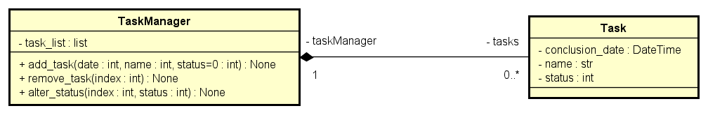

# Análise de Requisitos - Classes Task e Task Manager

## Classe Task

### Objetivo
A classe `Task` tem como objetivo representar uma tarefa em um sistema de lista de tarefas. Ela é responsável por armazenar informações sobre a tarefa, como seu identificador, data de conclusão, nome e status.

### Requisitos Funcionais
1. **Armazenamento de Informações da Tarefa**
   - A classe deve ser capaz de armazenar as seguintes informações de uma tarefa:
     - Identificador único da tarefa.
     - Data de previsão de conclusão da tarefa.
     - Nome.
     - Status da tarefa (por exemplo, pendente, em andamento, concluída).

2. **Recuperação de Informações da Tarefa**
   - Deve ser possível recuperar as informações de uma tarefa, incluindo sua data de conclusão, nome e status.

3. **Atualização de Informações da Tarefa**
   - A classe deve permitir a atualização das informações de uma tarefa, incluindo a alteração da data de conclusão, nome e status.

4. **Exclusão de Tarefas**
   - Deve ser possível excluir uma tarefa da lista de tarefas.

### Considerações Adicionais
- A classe `Task` deve ser bem documentada, incluindo comentários explicativos em seu código-fonte e documentação externa sobre seu uso e funcionamento.
- Deve-se seguir as convenções de nomenclatura e estilo de código estabelecidas pelo projeto ou equipe de desenvolvimento.

## Classe Task Manager

### Objetivo
A classe `Task Manager` tem como objetivo gerenciar as tarefas em um sistema de lista de tarefas. Ela é responsável por adicionar, recuperar, atualizar e excluir tarefas.

### Requisitos Funcionais
1. **Adicionar Tarefa**
   - Deve ser possível adicionar uma nova tarefa à lista de tarefas.

2. **Recuperar Tarefa**
   - Deve ser possível recuperar uma tarefa específica com base em seu identificador.

3. **Atualizar Tarefa**
   - Deve ser possível atualizar as informações de uma tarefa existente, incluindo sua data de conclusão, nome e status.

4. **Excluir Tarefa**
   - Deve ser possível excluir uma tarefa da lista de tarefas.

### Considerações Adicionais
- A classe `Task Manager` deve interagir com a classe `Task` para realizar operações relacionadas às tarefas.
- Assim como a classe `Task`, a classe `Task Manager` deve ser bem documentada e seguir as convenções de nomenclatura e estilo de código estabelecidas pelo projeto.

## Arquivos
##### Diagrama de Classe: 

Este diagrama representa a estrutura de classes do projeto de lista de tarefas, incluindo as classes `Task` e `Task Manager`, bem como suas relações e atributos.
